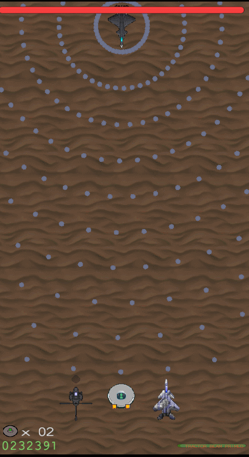
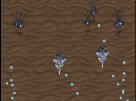
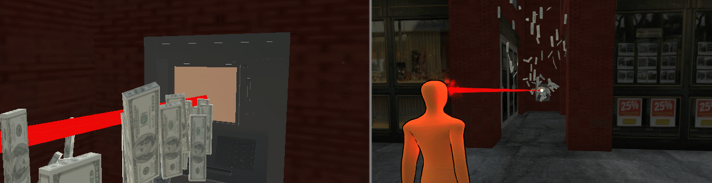
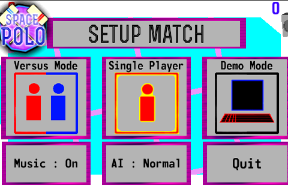
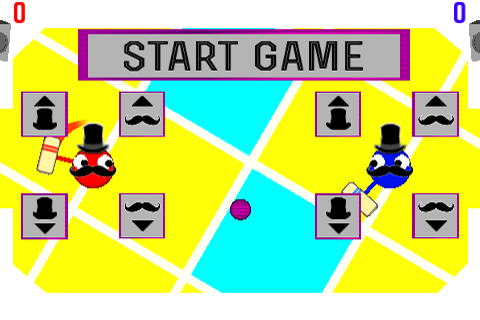
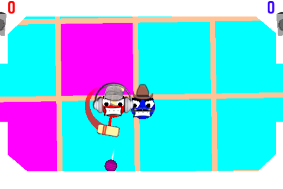
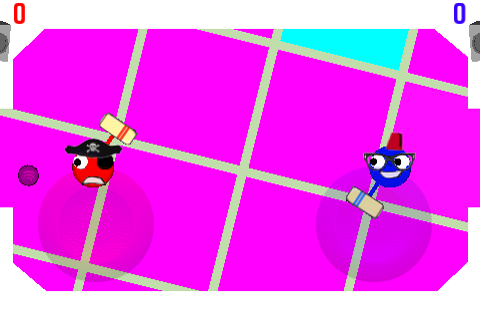
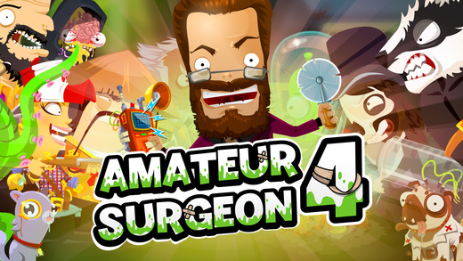

Hi, this is my new updated static site for showing my work and generally what I've been up to.
So I'm going to start with a rough timeline of what I've worked on over a few posts.

### 2014:
#### SHMUP experiments
I worked on some a SHMUP in Unity where I worked on a unique game mechanic based around capturing enemy units to fight alongside you

At the time I was trying to demonstrate my skills in Unity and C#, and handling efficient memory management in C# so I decided to make a SHMUP with tons of bullets in the Bullet Hell genre.
 

#### Game Jams
I took part in a few game jams where I was usually running a local event for my university Game Development Society.

Asymmetrical Multiplayer Superhero Vs Supervillain prototype:

My first Android app game I made with same-screen multiplayer:

### 2016:
#### Burke & Best
I worked for a year at a mobile game development company called Burke & Best in Canterbury UK, where I shipped
<b>Amateur Surgeon 4</b> for Android and iOS.
I was mainly responsible for the Android port, but we had a small team of 3 programmers so everyone worked on the client.

