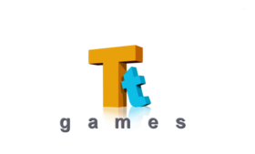
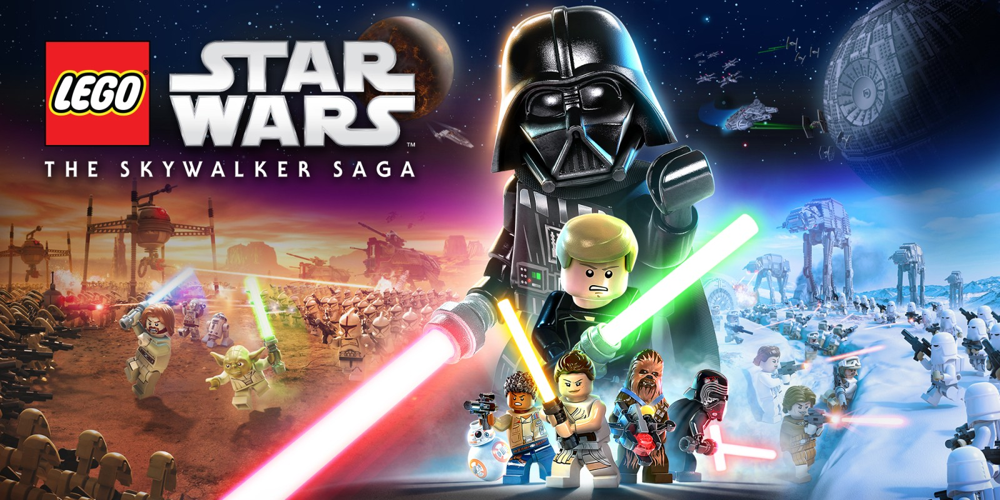

From 2017-2022 I worked with the Warner Bros studio - TT Games (Travellers Tales)
during this time I was involved in the development of a number of games shipped on multiple platforms with a bespoke C++ game engine.

While I was primarily a Tools programmer, we developed an entirely new game engine at the time which necessitated a whole new editor suite, this was a very fun project.

Throughout my time there, I got to also provide assistance on last-minute bug fixes and some gameplay code for demos on some of our titles shipped on the old game engine as well so this was a very formative experience for me.

My credits include:
LEGO Marvel Super Heroes 2
LEGO The Incredibles
The LEGO Movie 2 VideoGame
LEGO DC SuperVillains
and most proudly...
<b>LEGO Star Wars: The Skywalker Saga</b>

